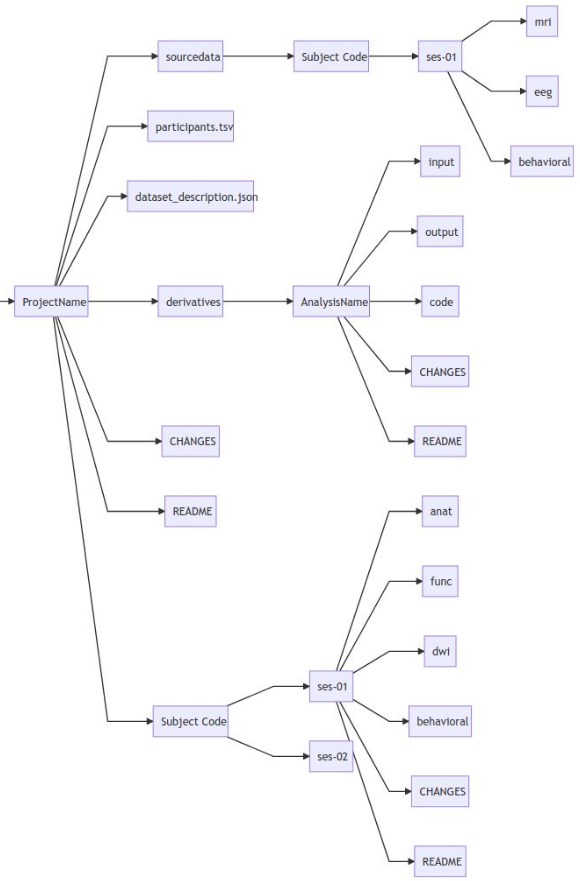

.. _ref_heavy_storage:

Dealing with heavy data storage
===============================

BrainData
---------

Brain imaging data can be very heavy! It is very probable that you won't be able to keep all your data on your computer. The SCIL offers you access to a very big network of storage space. You can mount BrainData in the directory you wish.

.. code-block:: bash

    path_local=/braindata #You can name it as you wish, but please place it directly after the root (/)
    mkdir $path_local
    sshfs USER@braindata.scil.usherbrooke.ca:/braindata $path_local

The main directories inside BrainData are:

    - | databases: Raw folders (anat/dwi) for various databases, in nifti format. Currently, this directory can only be modified by some authorized users such as Arnaud, who makes sure everything stays clean and in BIDS format (see next section). You can ask him if you think another database should be added. We could eventually add processed data too if your preprocessing is absolutely finished and clean and if you have a singularity to allow people to reproduce your results.
    - processedData: **This is where you could store the processed data for your project**. We don't force BIDS format here but please keep your directory names meaningful and clean your files as often as possible.
    - references: Miscellaneous resources you could find useful, such as atlases, books, previous conferences' posters, the list of publications by members of the SCIL, the list of previous student's thesis and so on.

Globus
------

ToDo

BIDS
----

`BIDS (Brain Imaging Data Structure) <https://bids.neuroimaging.io/>`_ is a new norm telling you how to organise your data. As explained on their website:

*Neuroimaging experiments result in complicated data that can be arranged in many different ways. So far there is no consensus how to organize and share data obtained in neuroimaging experiments. Even two researchers working in the same lab can opt to arrange their data in a different way. Lack of consensus (or a standard) leads to misunderstandings and time wasted on rearranging data or rewriting scripts expecting certain structure. Here we describe a simple and easy-to-adopt way of organising neuroimaging and behavioral data.*

Please ask Arnaud if you want more information. Here is a brief summary on how to use BIDS.

The BIDS organisation allows you to include raw data as well as preprocessed/processed data (called **derivatives**), as long as every modification is described in details. As so, every dataset
MUST include a dataset_description.json, a JSON file describing the dataset.

================== =====
Field              Information
================== =====
Name               REQUIRED. Name of the dataset.
BIDSVersion        REQUIRED. The version of the BIDS standard that was used.
License            | RECOMMENDED. What license is this dataset distributed under?
                   | The use of license name abbreviations is suggested for specifying a license.
                   | A list of common licenses with suggested abbreviations can be found in Appendix II.
Authors            OPTIONAL. List of individuals who contributed to the creation/curation of the dataset.
Acknowledgements   OPTIONAL. List of individuals who contributed to the creation/curation of the dataset.
HowToAcknowledge   | OPTIONAL. Instructions how researchers using this dataset should acknowledge the original authors.
                   | This field can also be used to define a publication that should be cited in publications that use the dataset.
Funding            OPTIONAL. List of sources of funding (grant numbers)
ReferencesAndLinks OPTIONAL. List of references to publication that contain information on the dataset, or links
DatasetDOI         OPTIONAL. The Document Object Identifier of the dataset (not the corresponding paper).
================== =====

Also, you must organize your folders as follows. All names must be in lower case.

