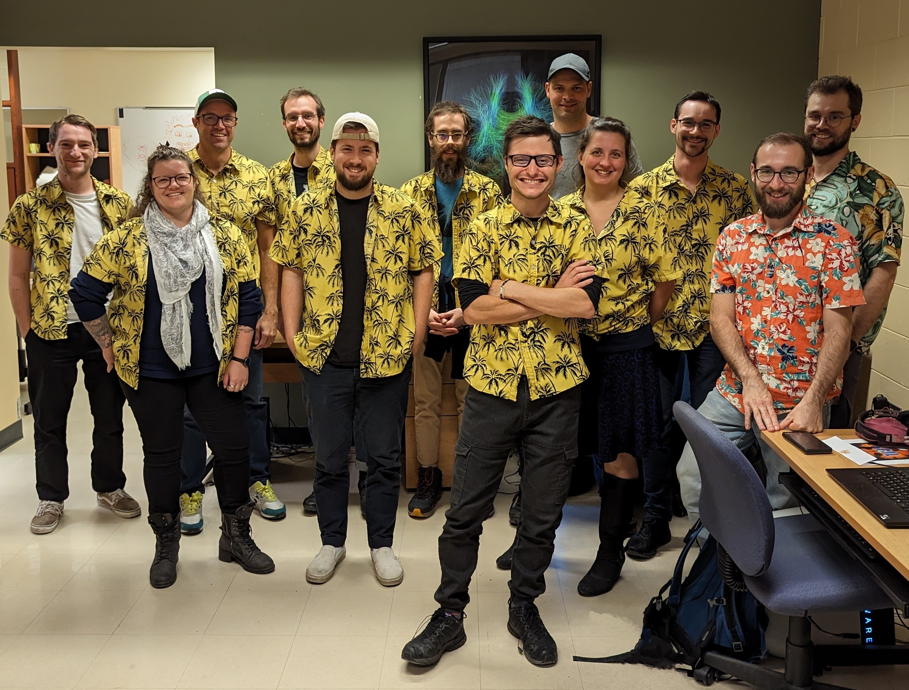

.. image:: /images/logo_scil_blanc.png
   :scale: 20 %
   :align: right

Welcome to the SCIL lab documentation!
=============================================

Our lab works in diffusion MRI, from the acquisition sequences and local reconstruction to tractography and its usages in applied contexts, including tractometry.

Here, you will find a summary of the tools we develop, and some clues on how we do things in the lab, from using Linux to developing code.

.. toctree::
    :maxdepth: 1
    :caption: Arriving in the lab

    arriving/welcome
    arriving/setup_computer
    arriving/setup_personal_computer
    arriving/whats_next

.. toctree::
    :maxdepth: 1
    :caption: Tools

    tools/scilpy
    tools/flows
    tools/tractoflow
    tools/recobundles
    tools/other_pipelines
    tools/machine_learning
    tools/others

.. toctree::
    :maxdepth: 1
    :caption: Guides

    guides/linux
    guides/python
    guides/git
    guides/virtual_machines
    guides/nextflow
    guides/code_with_nextflow
    guides/anatomy

.. toctree::
    :maxdepth: 1
    :caption: Coding standards in the lab

    coding/python
    coding/scilpy
    coding/git

.. toctree::
    :maxdepth: 1
    :caption: Dealing with heavy data

    heavy/storage
    heavy/computing

.. toctree::
    :maxdepth: 1
    :caption: Other

    other/conferences
    other/scholarships
