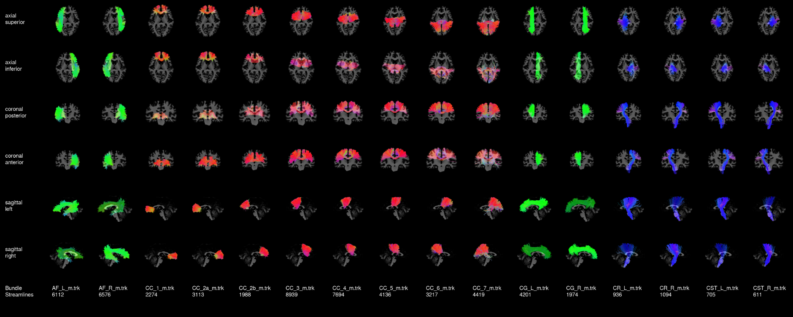
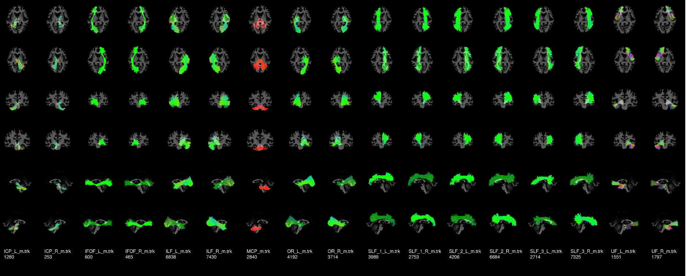

RecobundlesX
============

Recobundles is a tool to separate your wholebrain tracking result into different bundles divided into separate files. Dipy has a published version, called Recobundles. It is single atlas and single parameter while our version (which we call RecobundlesX) is multi-atlas and multi-parameter, and shown to be more robust in Rheault 2020 (PhD thesis, chapter 4, https://savoirs.usherbrooke.ca/handle/11143/17255).
An atlas is available `on zenodo <https://zenodo.org/records/7950602>`_ (models, config and reference).
There is a Nextflow pipeline for this tool, available `on Github <https://github.com/scilus/rbx_flow/>`_

You can find the description of Dipy single atlas / single parameter `here <https://dipy.org/documentation/0.16.0./examples_built/bundle_extraction/>`_.  We also provide a convenient wrapper for that version in scil_recognize_single_bundle.py which is simpler to use. For multiple bundles however, we highly recommend scil_recognize_multi_bundle.py (i.e. RecobundlesX).

Here is an example of how to run RecobundlesX. In the following script, we take the example of data that has been preprocessed using :ref:`ref_tractoflow`. tractoflow_folder is your root, which should contain tractoflow's results for each subject. This script will create a RecobundlesX folder inside each subject's directory.

Before running, read carefully the script's documentation (-h) in Scilpy.

You will need :ref:`ref_ants`

.. code-block:: bash

    tractoflow_folder=my_dir
    subject_list=my_subject_list.txt
    models_path=YOUR_PATH           # Ex: hcp_models/
    model_T1=THE_T1                 # Ex: ${models_path}/mni_masked.nii.gz
    model_config=JSON_FILE          # Ex: ${models_path}/config_python.json

    # Filtering options (in mm). Change as needed.
    minL=20
    maxL=200

    # RecobundlesX options. Change as needed.
    nb_total_executions=9    # len(model_clustering_thr) * len(bundle_pruning_thr) * len(tractogram_clustering_thr) = max total executions (see json).
    thresh_dist="10 12"      # Whole brain clustering threshold (in mm) for QuickBundles.
    processes=6              # Number of thread used for computation.
    seed=0                   # Random number generator initialisation.
    minimal_vote=0.5         # Saving streamlines if recognized often enough.

    while IFS= read -r subj; do
        echo "Running subject ${subj}"

        # Defining subj folders
        subj_folder=${tractoflow_folder}/${subj}

        # Defining inputs
        subj_trk=${subj_folder}/Tracking/${subj}__local_tracking*.trk
        subj_T1=${subj_folder}/Register_T1/${subj}__t1_warped.nii.gz

        ###
        # Registering model on subject (using ANTS)
        #   -d=image dimension,
        #   -f=fixed image, m=moving image
        #   -t: transformation a = rigid+affine
        #   -n = nb of threads
        # This should create 3 files : model_to_subj_anat0GenericAffine.mat,
        # model_to_subj_anatInverseWarped.nii.gz and  model_to_subj_anatWarped.nii.gz
        ###
        model_to_subj=${rbx_folder}/model_to_subj_anat
        antsRegistrationSyNQuick.sh -d 3 -f ${subj_T1} -m ${model_T1} -t a -n 4 -o ${model_to_subj}

        ###
        # Cleaning tracking file to make sure it is not too big.
        # Recobundles is already long enough :) .
        ###
        subj_filtered_trk=${subj_folder}/Tracking/${subj}__tracking_filteredLength.trk
        scil_filter_streamlines_by_length.py --minL $minL --maxL ${maxL} ${subj_trk} ${subj}_filtered_trk

        ###
        # Scil's Recobundle
        #   processes = nb of threads.
        #   Seed = rnd generator seed.
        #   inverse is to use the inverse affine
        ###
        mkdir ${rbx_folder}/multi_bundles
        scil_recognize_multi_bundles.py ${subj}_filtered_trk ${model_config} ${atlas_dir} ${affine} \
            --out_dir ${rbx_folder}/multi_bundles \
            --processes ${processes} --seeds ${seed}  \
            --minimal_vote_ratio ${minimal_vote} \
            --log_level DEBUG --inverse -f 
    done < ${subject_list}

To visualize your results for one subject, here is a nice tool:

    .. code-block:: bash

        anat=YOUR_ANAT
        rbx_folder=YOUR_RBX_FOLDER
        scil_visualize_bundles_mosaic.py ${anat} ${rbx_folder}/*.trk mosaic.png

Here is a nice example to help your compare your results. This was created from a HCP subject.

