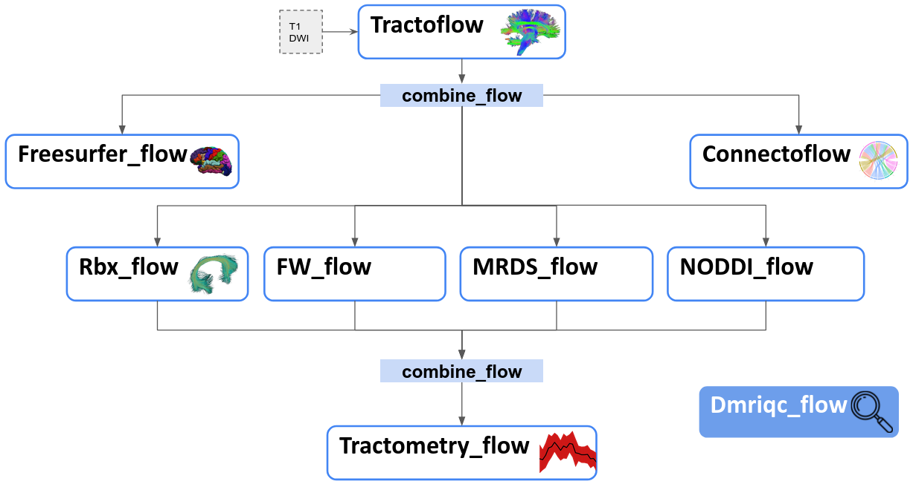

.. _ref_flow:

Flows
=====

What's a Flow?
**************

A *flow* is an automated processing pipeline built with `Nextflow <https://www.nextflow.io>`_.  
Flows integrate multiple tools and dependencies and are designed to streamline various stages of data processing.

Our Flows
*********

At the SCIL, we have developed a set of modular flows that cover different stages of diffusion MRI analysis. These flows are designed to work together in sequence or as standalone tools, depending on your needs.

.. list-table:: 
   :widths: 20 20 20 20

   * - **Flow**
     - **What it does**
     - **Version**
     - **Container**
   * - **Tractoflow**
     - Starts from raw DWI and generates a whole-brain tractogram.
     - ``2.4.4``
     - ``2.1.0``
   * - **Rbx_flow**
     - Extracts bundles from a whole-brain tractogram.
     - ``2.4.4``
     - ``2.1.0``
   * - **Tractometry_flow**
     - Extracts tractometry information by combining subjects’ fiber bundles and any metric in diffusion space.
     - ``2.4.4``
     - ``2.1.0``
   * - **Connectoflow**
     - State-of-the-art structural connectivity (connectomics) pipeline.
     - ``2.4.4``
     - ``2.1.0``
   * - **Bst_flow**
     - Enhances fODFs to run bundle-specific tractography.
     - ``2.4.4``
     - ``2.1.0``
   * - **Freewater_flow**
     - Computes Free Water–corrected DTI metrics.
     - ``2.4.4``
     - ``2.1.0``
   * - **Noddi_flow**
     - Runs the NODDI priors estimation and modeling pipeline.
     - ``2.4.4``
     - ``2.1.0``
   * - **Freesurfer_flow**
     - Surface parcellation using Freesurfer outputs.
     - ``2.4.4``
     - ``2.1.0``
   * - **Mrds_flow**
     - Models directional signal (MRDS) from dMRI.
     - ``2.4.4``
     - ``2.1.0``
   * - **Dmriqc_flow**
     - QC for any output from most SCIL flows.
     - ``1.0.0``
     - ``1.5.0``

Using a Flow
************

No matter which flow you use, the process follows the same basic steps:

1. **Prepare the input data**  
   Organize your dataset according to the flow’s expected input structure.  
   If using a sequence of flows, you can use `combine_flows`, a set of bash scripts that connects our flows together. These scripts create a valid input structure for a flow based on another flow’s output.

2. **Pull the container**  
   Make sure the correct container is downloaded. You just need to pull the flow using: ``nextflow pull scilus/<flow_name>``

3. **Run the flow**  
   Execute the pipeline using ``nextflow run ...`` with the appropriate parameters.

4. **Quality check the output**  
   After execution, inspect results manually or use `Dmriqc_flow`, our quality control pipeline for diffusion MRI.  
   With different profiles, you can QC any output from most SCIL flows.

.. note::
   To use our flows, you will need:

   - `Nextflow <hhttps://www.nextflow.io/docs/latest/install.html#install-nextflow>`_ (version between 19.04.2 and 21.12.1)  
   - `Singularity <https://apptainer.org/docs/admin/1.4/installation.html#installation-on-linux>`_ (Linux) or `Docker <https://docs.docker.com/engine/install/>`_ (Mac/Linux)  
   - The corresponding scilus `.sif` or Docker image based on the flow’s container version  

For detailed instructions, refer to the tutorials below.

Tutorial
********

In this tutorial, we will show you how to go from **raw data** to **tractometry** and **connectivity maps** using our series of flows.

To follow along, we recommend using the prepared **dataset** below:

.. code-block:: bash

    mkdir flows_tuto
    curl https://nextcloud.computecanada.ca/index.php/s/D5oCMGawsEi8Cps/download -o flows_tuto/flows_tuto.tar.gz
    tar -xzf flows_tuto/flows_tuto.tar.gz -C flows_tuto/

It includes one subject in both BIDS and non-BIDS formats.  
`BIDS <https://bids.neuroimaging.io/index.html>`_ is a standardized structure for organizing neuroimaging data.

Included files:

- ``t1``: anatomical T1-weighted scan

- ``dwi``: diffusion-weighted images

- ``rev_b0``: reverse-phase encoding image (for distortion correction)

Requirements
~~~~~~~~~~~~

Install `Nextflow <https://www.nextflow.io/docs/latest/install.html#install-nextflow>`_ (version between 19.04.2 and 21.12.1)  
Check installation:

.. code-block:: bash

   nextflow -version

Install either:

- `Singularity <https://apptainer.org/docs/admin/1.4/installation.html#installation-on-linux>`_ (Linux)  

  Check installation:

  .. code-block:: bash

     singularity --version

- `Docker <https://docs.docker.com/engine/install/>`_ (Mac or Linux)  

  Check installation:

  .. code-block:: bash

     docker --version

Now ensure that all required containers are downloaded to run the flows.

If using **Singularity**, download the required container files:

.. code-block:: bash

   ...

If using **Docker**, the containers will be pulled automatically when running a flow ?

Dmriqc_flow
~~~~~~~~~~~

Dmriqc_flow is our pipeline for diffusion MRI quality control. Using different profiles, you can QC the output from most SCIL flows. Let's start by QC-ing the raw input data.

1. **Pull the container**

2. **Run the command**

.. code-block:: bash

   # If using Singularity
   nextflow run scilus/dmriqc_flow --input tutorial_data_scil/input_raw/ --output qc_results/ -with-singularity scil_1.5.0.sif

   # If using Docker
   nextflow run scilus/dmriqc_flow --input flows_tuto/sub-01/ --output qc_results/ -with-docker

Tractoflow
~~~~~~~~~~

Tractoflow is the main flow to preprocess diffusion data and generate tractograms and metrics.

1. **Prepare the input data**  
   BIDS and non-BIDS ??

2. **Pull the container**

3. **Run the flow**

.. code-block:: bash

   # If using Singularity
   nextflow run scilus/dmriqc_flow -r 1.0.0 --input tutorial_data_scil/input_raw/ --output qc_results/ -with-singularity scil_1.5.0.sif

   # If using Docker
   nextflow run scilus/dmriqc_flow -r 1.0.0 --input flows_tuto/sub-01/ --output qc_results/ -with-docker

4. **QC the output**  
   You can reuse Dmriqc_flow here to inspect the outputs..

Rbx_flow
~~~~~~~~

Rbx_flow (RecobundlesX) extracts anatomical bundles from a whole-brain tractogram.

1. **Prepare the input data**  
   You can use `combine_flow` to format inputs appropriately.

2. **Pull the container**  

3. **Run the flow**

.. code-block:: bash

   # If using Singularity
   nextflow run scilus/dmriqc_flow --input tutorial_data_scil/input_raw/ --output qc_results/ -with-singularity scil_1.5.0.sif

   # If using Docker
   nextflow run scilus/dmriqc_flow --input flows_tuto/sub-01/ --output qc_results/ -with-docker

4. **QC the output**  
   You can use Dmriqc_flow...